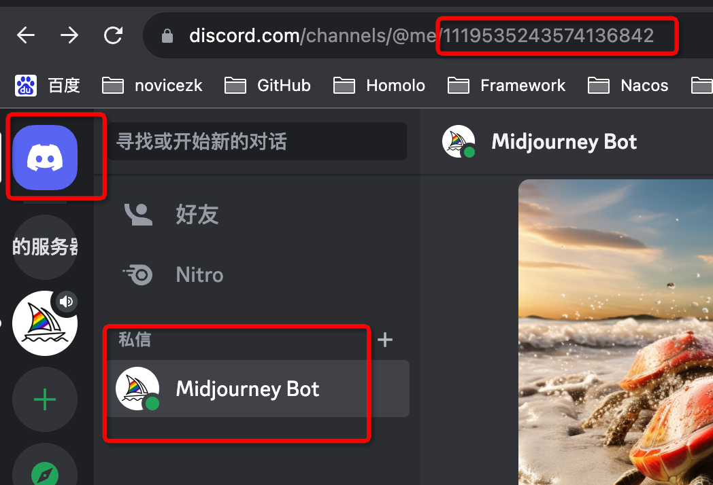

## 获取discord账号参数

### 1. 获取用户Token
进入频道，打开network，刷新页面，找到 `messages` 的请求
- Authorization 即用户Token，后续设置到 `user-token`
- User-Agent 后续设置到 `user-agent`

### 2. 获取用户sessionId
进入频道，打开network，发送/imagine作图指令，找到 `interactions` 的请求，这里的 session_id 即用户sessionId，后续设置到 `session-id`

### 3. 获取服务器ID、频道ID

频道的url里取出 服务器ID、频道ID，后续设置到账号的 `guild-id`、`channel-id`

### 4. 获取MJ私信ID

url里取出 私信ID，后续设置到账号的 `mj-bot-channel-id`，获取图片seed功能需要用到
